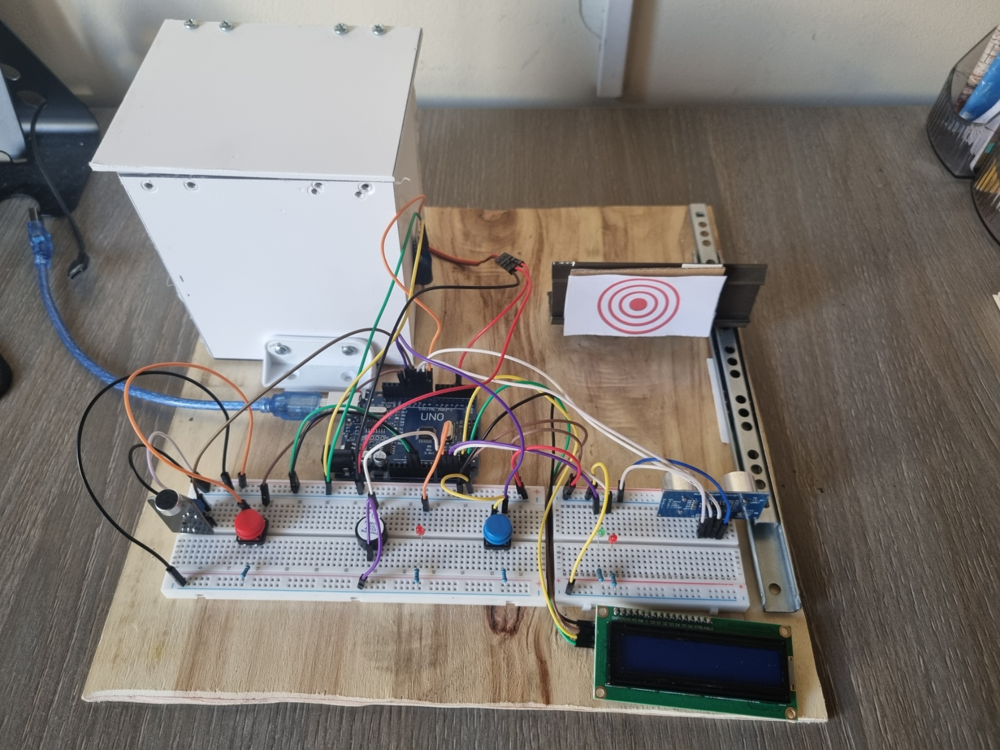

# Interactive Chest Project

## Overview
The Interactive Chest Project is a creative and educational Arduino-based endeavor that combines sound detection and distance testing to create an engaging interactive experience. Users activate the chest by clapping or snapping their fingers, initiating a sequence where they must pass a distance-based test to unlock the chest and claim a prize.

## Project Image

## Demo

[Click to see the demo](https://drive.google.com/file/d/1-HbAMneb_CkbjtMgT6UcyaFAOKFzM4x0/view?usp=drive_link)

## Components
- Arduino UNO: Central control for the entire system.
- Sound Sensor: Detects specific sounds to initiate the game.
- Ultrasonic Sensor: Measures the distance for the interactive test.
- Servo Motor: Actuates the chest door based on the distance test result.
- Confirmation Button: Allows users to confirm correct object placement.
- LCD Screen: Displays relevant information and game status.
- LEDs: Visual indicators for the current game state.
- Buzzer: Audible signal for successful game completion.
- Infrared Sensor (Optional): Detects when the prize is removed, triggering the automatic closing of the chest door.
- Chest Structure: Physical construction materials for the chest and servo-controlled door.

## Installation and Usage (for End-Users)
To use the Interactive Chest, follow these steps:
1. [Install Arduino IDE](https://www.arduino.cc/en/software).
2. Clone the project repository
3. Open the project in Arduino IDE.
4. Upload the code to your Arduino board.
5. Connect the components following the wiring instructions in the code.
6. Power on the system and enjoy the interactive experience!

